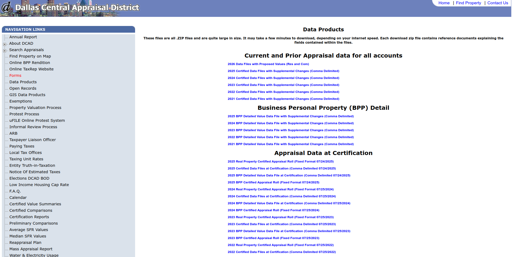
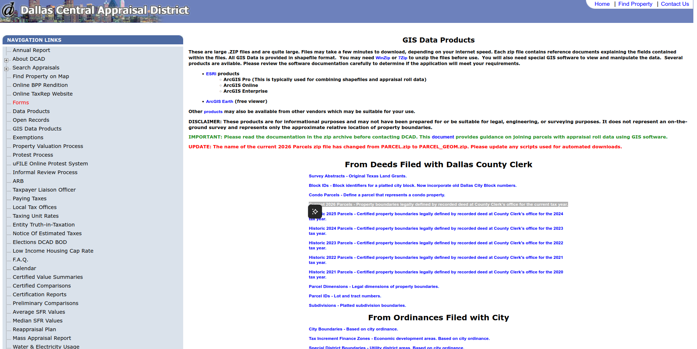
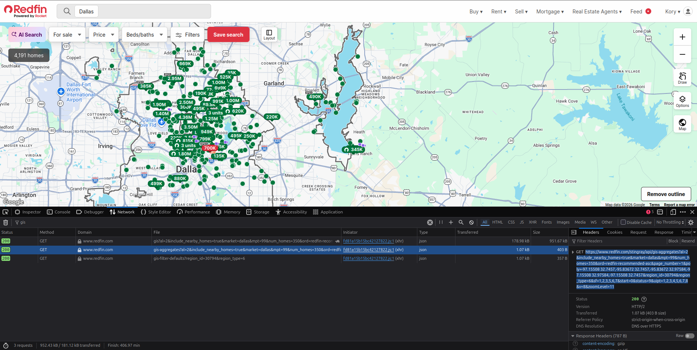
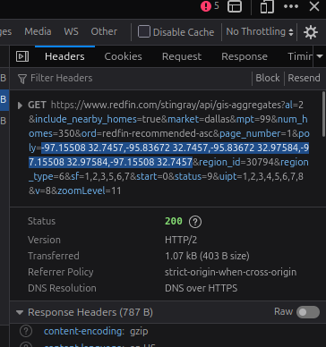

# Dallas Off-Market Property Finder

Pulls every active listing from Redfin for any area in Dallas and cross-references
it against Dallas County Appraisal District (DCAD) records — which cover **every
property that exists**, not just the ones for sale. The output tells you who owns
each property, what it's worth, and whether it's listed anywhere.

---

## Installation

### Step 1 — Install Python

**Windows:**
1. Go to [python.org/downloads](https://www.python.org/downloads/)
2. Click **Download Python**
3. Run the installer — on the first screen, **check the box that says "Add Python to PATH"** before clicking Install. This is easy to miss and the script won't run without it.
4. Verify it worked: open Command Prompt and run `python --version`

**Mac:**
1. Go to [python.org/downloads](https://www.python.org/downloads/)
2. Download and run the installer
3. Verify: open Terminal and run `python3 --version`

**Linux:**
```bash
sudo apt install python3 python3-pip
```

---

### Step 2 — Download the code

**Windows:**
1. Go to [git-scm.com/download/win](https://git-scm.com/download/win), download and run the installer, click through all the defaults
2. Open Command Prompt and run:
```
git clone https://github.com/kosmickroma/redfin.git
cd redfin
pip install -r requirements.txt
```

**Mac:**
1. Open Terminal and run `git --version` — Mac will prompt you to install Git automatically
2. Then run:
```
git clone https://github.com/kosmickroma/redfin.git
cd redfin
pip3 install -r requirements.txt
```

**Linux:**
```
sudo apt install git
git clone https://github.com/kosmickroma/redfin.git
cd redfin
pip3 install -r requirements.txt
```

---

### Step 3 — Download DCAD property data (one time)

This is the Dallas County property records database. Free and public. You download it
once and it stays on your machine.

1. Go to [dallascad.org/dataproducts.aspx](https://dallascad.org/dataproducts.aspx)
2. Under the **"Current and Prior Appraisal data for all accounts"** section (top of the page), click **2026 Data Files with Proposed Values (Res and Com)**



3. Extract the ZIP — you need these four files:
   - `ACCOUNT_INFO.CSV`
   - `ACCOUNT_APPRL_YEAR.CSV`
   - `RES_DETAIL.CSV`
   - `LAND.CSV`
4. Create a folder called `dcad_data` inside the `redfin` folder and place all four files in it

---

### Step 4 — Download DCAD parcel map data (one time)

This gives every property its exact GPS location so pins land on the actual lot.

1. Go to [dallascad.org/dataproducts.aspx](https://dallascad.org/dataproducts.aspx)
2. Click **GIS Data Products** in the left navigation (see screenshot below)
3. On the GIS Data Products page, scroll down until you see **Current 2026 Parcels** and download the ZIP file



4. Inside `dcad_data`, create a folder called `PARCEL_GEOM`
5. Extract the ZIP into that folder — you should have `PARCEL_GEOM.shp` inside it

---

### Your folder should look like this

```
redfin/
  analyze_block.py
  redfin_tool.py
  run.bat
  requirements.txt
  README.md
  dcad_data/
    ACCOUNT_INFO.CSV
    ACCOUNT_APPRL_YEAR.CSV
    RES_DETAIL.CSV
    LAND.CSV
    PARCEL_GEOM/
      PARCEL_GEOM.shp
      PARCEL_GEOM.dbf
      PARCEL_GEOM.shx
      PARCEL_GEOM.prj
```

---

## Running It

**Windows:** Double-click `run.bat` in the redfin folder

**Mac / Linux:**
```
python3 analyze_block.py
```

---

## Picking Your Area

The script gives you two options when it starts:

**Option 1 — Type a neighborhood name**

Type `1` and enter a neighborhood name. Built-in neighborhoods:

```
Bishop Arts       Bluffview         Deep Ellum
Devonshire        Far North Dallas  Highland Park
Knox Henderson    Lake Highlands    Lakewood
Lower Greenville  M Streets         North Dallas
Oak Lawn          Preston Hollow    Turtle Creek
University Park   Uptown            White Rock Lake
```

Spelling doesn't need to be exact — it will find the closest match.

---

**Option 2 — Draw a custom area on Redfin**

Use this when you want to analyze a specific block or any custom shape.

**Step 1 — Draw your shape on Redfin**

Go to redfin.com, find the area, and use the draw tool to draw your shape on the map.

**Step 2 — Open DevTools and get the URL**

Once you've drawn your shape, press **F12** to open the browser developer tools.
Click the **Network** tab and type `gis` in the filter box.
Go back to the map and pan or move it slightly — requests will appear in the list.



Click any of the new requests that appear. A panel opens on the right side — click the **Headers** tab if it's not already selected. At the very top of that panel you'll see the full URL starting with `GET https://www.redfin.com/stingray/api/gis` — the coordinates are highlighted in blue.



Right-click directly on that URL and select **Copy link address**.

**Step 3 — Save the URL to a text file**

Open **Notepad** (Windows) or any text editor, paste the URL, and save it with any name you want — e.g. `highland_park.txt` — inside the redfin folder.

You can save as many of these as you want and come back to them any time.

**Step 4 — Run the script**

Run the script, type `2`, and it will list all the `.txt` files it finds in the folder. Pick the number next to the file you just saved.

---

## Output Files

Each run saves two files in the `output/` folder:

| File | What It Is |
|---|---|
| `block_analysis_[label].csv` | Full spreadsheet — open in Excel or Google Sheets |
| `map_[label].html` | Interactive map — open in any browser |

After a few runs your output folder will look like this:

```
redfin/
  output/
    block_analysis_highland_park.csv
    map_highland_park.html
    block_analysis_uptown.csv
    map_uptown.html
    block_analysis_lakewood.csv
    map_lakewood.html
```

---

## Reading the Output

**Finding teardown candidates:** Sort by **Land % of Total** descending.
A property where land is 70–90%+ of the total value means the land is worth
far more than the structure sitting on it. Combined with an old Year Built,
that's the owner to call.

**On/Off market:** Filter **Listed on Redfin** to `NO` to see only off-market
properties — owners who aren't selling publicly and may not know anyone is looking.

**Google Maps Link:** Click any row to open the property in Google Maps.

**Sharing the map:** Drag `map_[label].html` to [netlify.com/drop](https://netlify.com/drop)
to get a shareable link anyone can open in their browser.

---

## What's in the Spreadsheet

| Column | What It Is |
|---|---|
| Property Address | Street address |
| Listed on Redfin | YES = active listing / NO = off market |
| Owner Name | Who owns it |
| Owner Mailing Address | Where to send a letter |
| Owner City / State / Zip | Owner's mailing location |
| Land Value | County appraisal — land only |
| Improvement Value | County appraisal — structure only |
| Total Value | Combined county appraisal |
| Land % of Total | Key teardown signal |
| Year Built | Age of structure |
| Living Area (sq ft) | Interior square footage |
| Total Structure Area (sq ft) | Full structure footprint |
| State Code | Property type (e.g. Single Family Residences) |
| Zoning | How the parcel is zoned |
| Lot Size (sq ft) | Total lot area |
| Frontage (ft) | Street frontage |
| Depth (ft) | Lot depth |
| School District | ISD serving the property |
| Neighborhood Code | DCAD neighborhood classification |
| Subdivision | Subdivision name |
| Legal Description | Full legal description from county records |
| Google Maps Link | One click to street view |

---

## How Long Does It Take?

| Step | Time |
|---|---|
| Loading parcel shapefile | 10–20 seconds |
| Redfin pull (small area) | 30–60 seconds |
| Redfin pull (full neighborhood) | 2–4 minutes |
| DCAD join and output | A few seconds |

---

## Data Sources

| Source | What It Provides | How Current |
|---|---|---|
| Redfin | Active listings, list price, beds/baths/sqft | Live |
| DCAD | All properties, owner info, appraisal values | Updated annually |

---

## Notes

- Redfin has no public API — this tool uses the same data endpoint their website uses. It has worked reliably but is not officially supported.
- DCAD data updates once per year, typically each April. Download the new version when it's released.
- Condos and units will show zero frontage and depth — DCAD does not track individual unit dimensions. This is expected.
